# **Warehouse Navigation Application Developer Manual**
 
| Author/Producer | Hao Yuan, Tianyu Zhao, Haoyu Lyu, Yuanbo Zheng |
| --- | --- |
| Affiliation | The Samueli School of Engineering, University of California, Irvine |
 
# Version Modification Record
| **No.** | **Date** | **Version** | **Modified By** | **Modification** |
| --- | --- | --- | --- | --- |
| 5 | 2020/11/28 | V5.0 | All team member | UI update (timeout, start and end point), load orders form file, reconstructed base algorithms since definition of question changed, add greedy |
| 4 | 2020/11/06 | V4.0 | All team member | Update the document, add QMessage for mainwindow(generate path), enhance our map(location and path), add brute_force algorithm, update MakeMatrix.py, add Timeout, add test cases. |
| 3 | 2020/10/30 | V3.0 | All team member | Change some function#39;s description | 
| 2 | 2020/10/20 | V2.0 | All team member | Update the document,finish the development manual, add data structure and function. |
| 1 | 2020/10/13 | V1.0 | All team member | Generate All the New Doc. 
 
# Table of Contents
 
[1 Front Matter 4](#_Toc54200325)
 
[1.1 Glossary 4](#_Toc54200326)
 
[2 Overview of System 5](#_Toc54200327)
 
[2.1 Basic Features: 5](#_Toc54200328)
 
[2.1.1 Usage instructions/scenarios 6](#_Toc54200329)
 
[2.2 Advanced Features 8](#_Toc54200330)
 
[2.2.1 Usage instructions/scenarios 8](#_Toc54200331)
 
[3 Software Architecture Overview 9](#_Toc54200332)
 
[3.1 Main data types and structures 9](#_Toc54200333)
 
[3.2 Major software components 10](#_Toc54200334)
 
[3.3 Diagram of module hierarchy 10](#_Toc54200335)
 
[3.4 Module interfaces 11](#_Toc54200336)
 
[3.5 API of major module functions 12](#_Toc54200337)
 
[3.5.1 Overall program control flow 12](#_Toc54200338)
 
[4 Installation 12](#_Toc54200339)
 
[4.1 System requirements 12](#_Toc54200340)
 
[4.2 Setup &amp; configuration 13](#_Toc54200341)
 
[4.3 Uninstallation 13](#_Toc54200342)
 
[5 Documentation of packages, modules, interfaces 13](#_Toc54200343)
 
[5.1 Detailed description of data structures 13](#_Toc54200344)
 
[5.2 Detailed description of functions and parameters 15](#_Toc54200345)
 
[5.3 Detailed description of input and output formats 16](#_Toc54200346)
 
[6 Development plan and timeline 17](#_Toc54200347)
 
[7 Back Matter 18](#_Toc54200348)
 
[7.1 Copyright 18](#_Toc54200349)
 
[7.2 Error messages 18](#_Toc54200350)
 
[7.3 Index 18](#_Toc54200351)
 
## 1 Front Matter
 
## 1.1 Glossary
 
- **WoBoAI Inc.**
 
WoBoAI represents WorkerRobotAI, it is our company name.
 
- **QVWEP**
 
My client: QV&#39;s Warehouse of Extraordinary Products.
 
- **User ID**
 
The unique identification of QVWEP account on target platform. It should be user&#39; institution email address. QVWEP should give each user an email address ending with &quot;QVWEP.com&quot;, and they can use this account freely to use the platform. Or QVWEP may need to set the user ID for each user.
 
- **User Password**
 
A string that one-to-one corresponds to the QVWEP User ID. It needs input concurrently with the QVWEP User ID when logging in the platform. It is used for protecting account safety.
 
- **Product(s)**
 
Products are things that need to be picked up by workers and placed in designated locations.
 
- **Fields**
 
Fields should be an area or a point, it is the target position of all the products. Work should bring the products to fields.
 
## 2 Overview of System
 
Our program is a python-based system. This system consists of an application for our shopping carts gatherers at our **WoBoAI** store. The system allows our workers to login/change passwords and provides directions/instructions for the worker to pick up products that need to be returned to the &#39;Shopping Products Return Area. We will set some rules to generate our path, a specific number of products may have different paths to the Return area,etc.
 
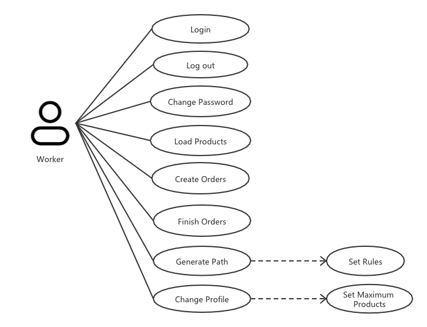
 
Figure 1 Use case
 
## 2.1 Basic Features:
 
The system has the following features:
 
1. User Login/Logout
2. Load Products/Generate Paths
3. Personal Settings (passwords, rules...)
4. Set start and end point & timeout for algorithm
5. Load orders from file
 
### 2.1.1 Usage instructions/scenarios
 
Scenario 1:
 
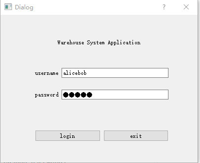
 
Figure 2 Login window
 
Logging in and Picking up products on an average day.
 
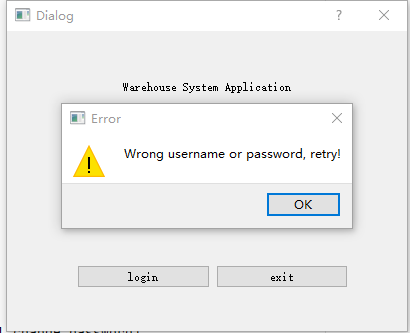
 
Figure 3 Failed login
 
Wrong Username/password, user need re-enter the correct username/password.
 
Scenario 2: Loading Graphs based on our txt file.
 
In this interface, a map with several products will be displayed. You can click buttons to load products, generate shortest paths by different rules/algorithms and create orders by clicking the &#39;Add Order&#39; button. Each time we add some products per order.
 
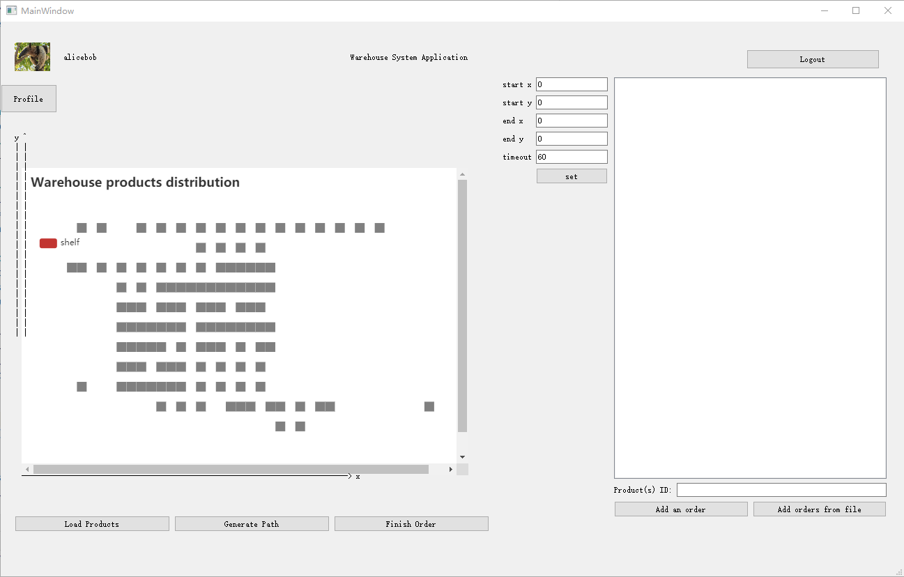
 
Figure 4 main window

If you have finished the orders, you can click on the line name with three IDs; Then you can click the finish button to finish the order, and it will be removed from that list.
 

 
Figure 5 Add an Order to the list
 
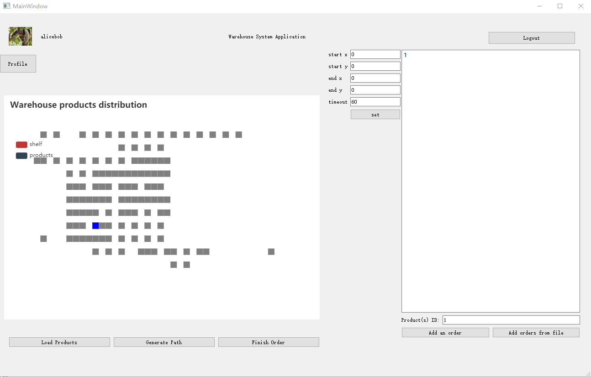
 
Figure 6 Finish one Order in the list
 
When you click the generate button without selecting an order, it will show you a message which you need to select an order first!
 
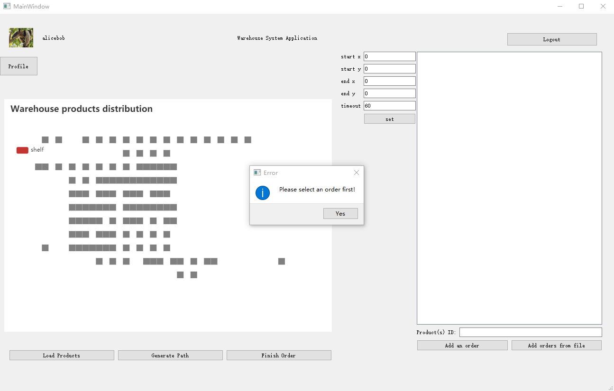
Figure 7 Generate path without selecting orders
 
After you select one order, when you click the &#39;Generate Path&#39; button, the graph below will show us a specific path from the starting point to the return area, a dialog will also shown under the graph which tells the user the meaning of this graph.
 
 
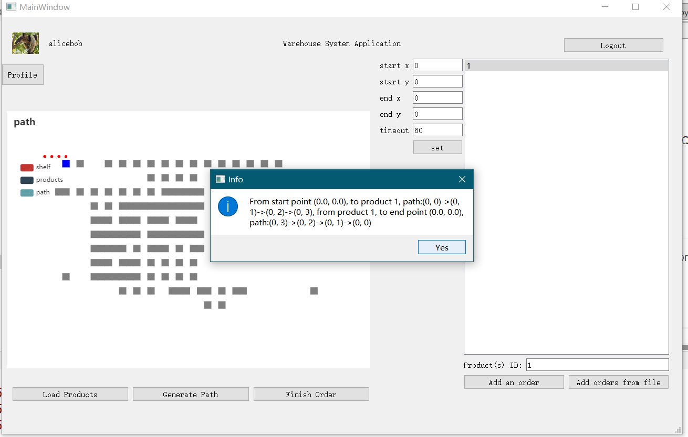
Figure 8 Generate path 
 
Scenario 3: Personal Settings.
 
In this case, you can click the user symbol on the top left corner of the interface. The worker can enter their personal settings to change passwords, set different rulers for the Paths and maximum products to deliver.
 
 
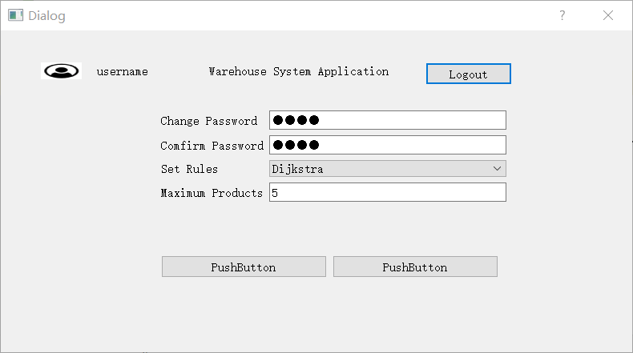
 
Figure 9 Personal setting
 
Scenario 4: Set start & end point & timeout for algorithm

In this case, uset can type in the start point and end point for the algorithm and the timeout(second) so the algorithm can set up the path for the user to follow. After setting is done then click the button to set the values.

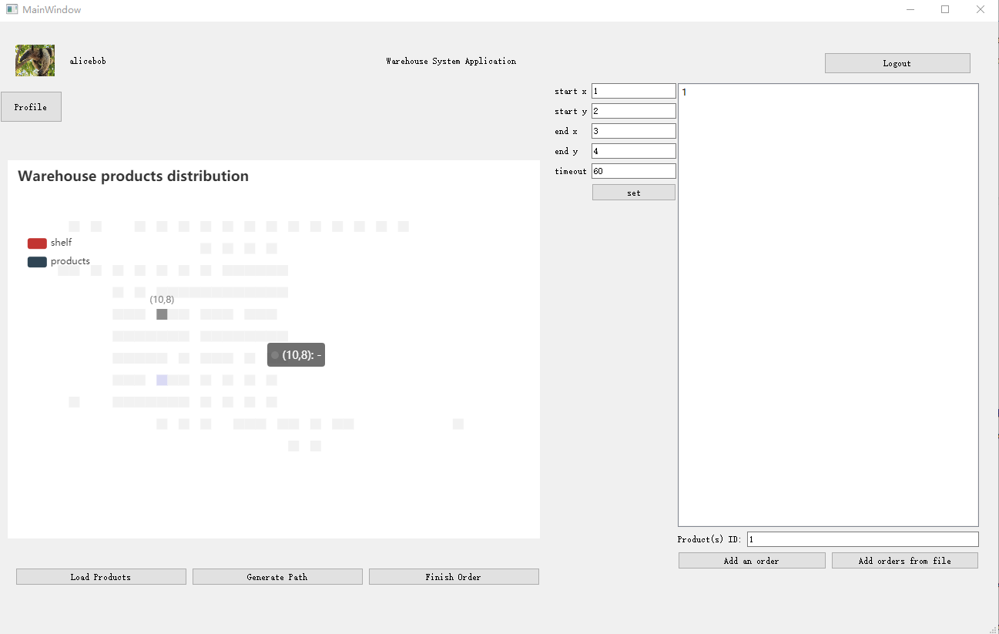
Figure 10 Set start & end point & timeout for algorithm

Scenario 5: Load orders from a single txt file

In this case, users can load many orders (product ID) from a local file. So the UI will show all future orders. 

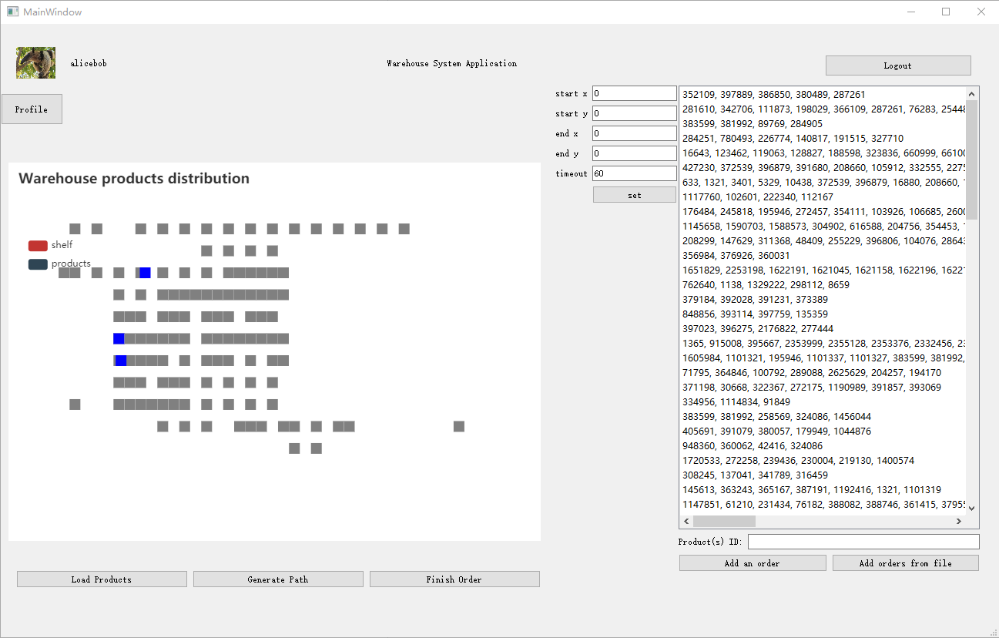

Figure 11 Load orders from a file

## 2.2 Advanced Features
 
The system has the following features:
 
1. Settings/Preferences: Generate Path by number of products
2. Settings/Preferences: Set Maximum Products
 
### 2.2.1 Usage instructions/scenarios
 
Scenario 1: Generating a Path for a specific number of products to the return area.

Scenario 2: Workers have a limitation of products each time. From the figure 9, you can see that in the personal setting, the worker can set the maximum number of products to deliver.
 
## 3 Software Architecture Overview
 
## 3.1 Main data types and structures
 

 
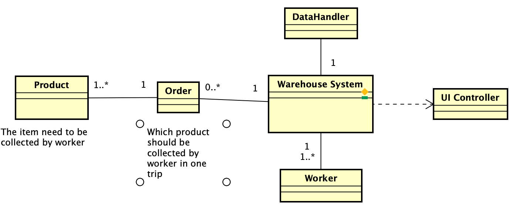
Figure 12 Class structure
 
The Warehouse System is the main part of the application. Its function will be called by the UI controller which is responsible for UI event listening. The warehouse system has at least one user which is also a Worker, who will move the products. Also it will have several orders which the Worker will deliver. For each order, it will have at least one Product to be collected by the Worker.
 
## 3.2 Major software components
 
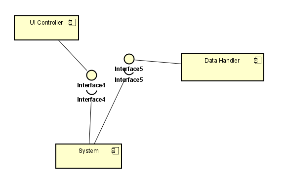
 
Figure 13 Interfaces
 
The system has three different components, one is UI controller, it controls GUI and communicates with the user or system. One is DataHandler, it controls the input and output of the system. The other one is System, it contains some structures to save information of worker products and orders, and it can also generate path etc.
 
## 3.3 Diagram of module hierarchy
 
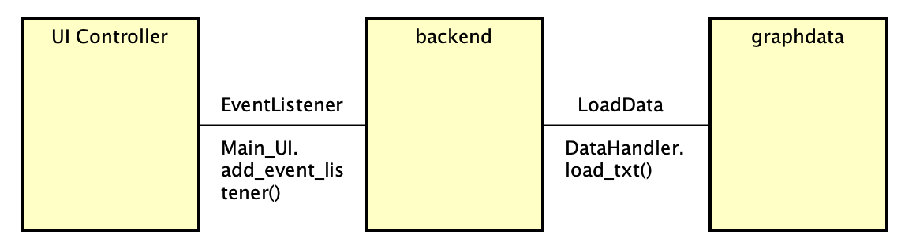
 
Figure 14 Module connections
 
The UI Controller Module will add event listeners to the UI component, which will trigger backend functions to display the result. Backend will only load the data when the user asks for it and will not write back anything to it.
 
## 3.4 Module interfaces
 
Worker: get\_password() - str, set\_password(new\_password) - None
 
DataHandler: load\_txt(filename) - None
 
WareHouse System: create\_order(int) - None, set\_rules(str) - None, generate\_path(str) - None,
 
UI Controller: draw\_path() - None
 
Order: init() - None
 
## 3.5 API of major module functions
 
### 3.5.1 Overall program control flow
 
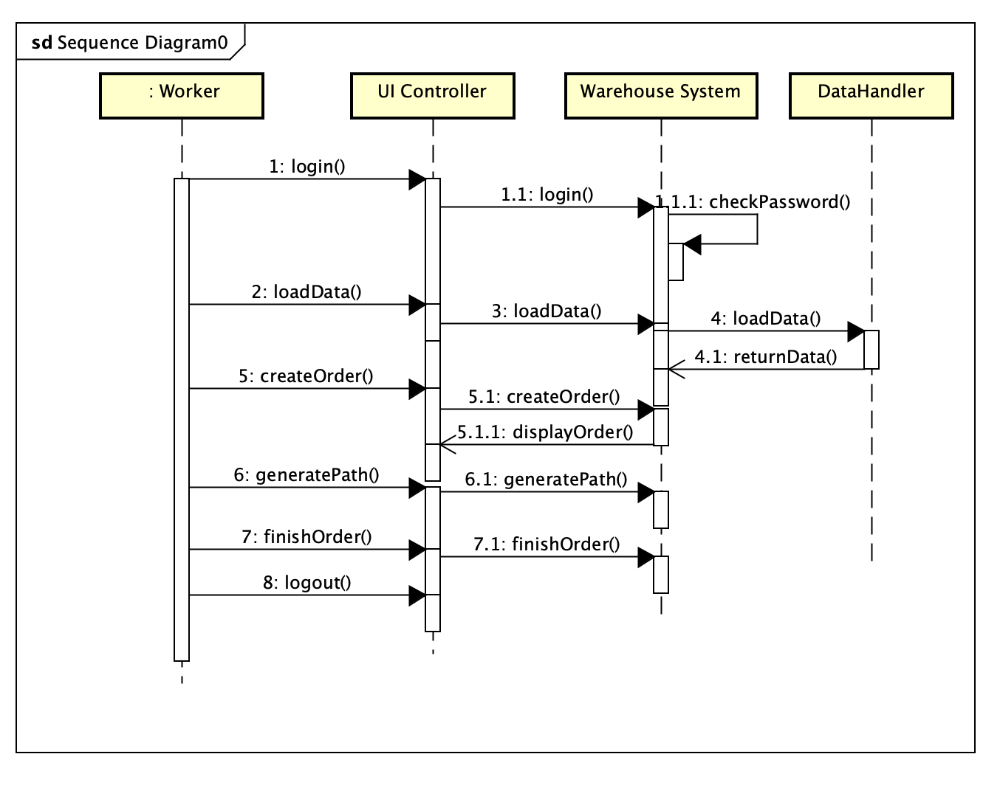
 
Figure 15 Sequence diagram for main functions
 
## 4 Installation
 
## 4.1 System requirements
 
Recommended PC Requirements:
 
Platform: Microsoft Windows 10 or Linux-based OS (e.g. Ubuntu)
 
CPU: Intel i5-4430 or AMD FX-6300
 
Memory: 1GB RAM
 
Storage: 1GB available space, graph data might be huge
 
## 4.2 Setup &amp; configuration
 
Requirements below:
 
anaconda3
 
Python 3.8
 
PyQt5 5.15.1
 
PyQt5-tools 
 
PyQtWebEngine 5.15.1
 
numpy
 
Matplotlib 3.3.2
 
Make sure you have installed python 3 and PyQt5 with version 5.15.0 (or above).
 
Run the python file, then you are good to go.
 
## 4.3 Uninstallation
 
If you don&#39;t want to use this application any more, simply delete its source files.
 
## 5 Documentation of packages, modules, interfaces
 
## 5.1 Detailed description of data structures
 
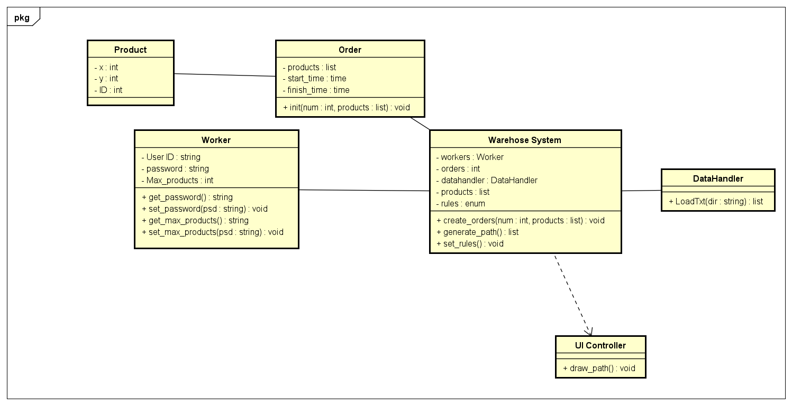
 
Figure 16 Class diagram of the system
 
Product:
 
It has three attributes which contain the location (x, y) and the product ID.
 
Order:
 
Each order contains some products, and those products are saved as a list in one order. And the other two attributes are start\_time and finish\_time that record when the order has been built and when the worker finishes this order.
 
Each order has one initialize function named init() that can add products into its products list, once the order has been initialized, it cannot be changed.
 
Worker:
 
This class is designed for workers. Each worker should have one user id and one password. Also, he has one attribute named Max\_products which means the maximum quantity he can carry at once.
 
The function get\_password, and change\_password is used for check and change password. Same as password, the Max\_products also has getter and setter functions.
 
Warehouse System:
 
This class has five attributes. Each Warehouse holds one worker, and has one DataHandler to load data. After loading data, the warehouse system will have all the information of the products in QVWEP which saves in one list named products. And the class can change different rules to generate paths.
 
There is one function named create\_orders, we pass a number and a list of products(optional), and the function will generate one order randomly. Function generate\_path() means generate path of the current order and set\_rules used to change different rules.
 
DataHandler:
 
This class used to load or save files. For our system, all the data is saved as a txt file, we should call that LoadTxt function to load data.
 
UI Controller:
 
This class used to control GUI and communicate with system/users.
 
- Critical snippets of source code:
 
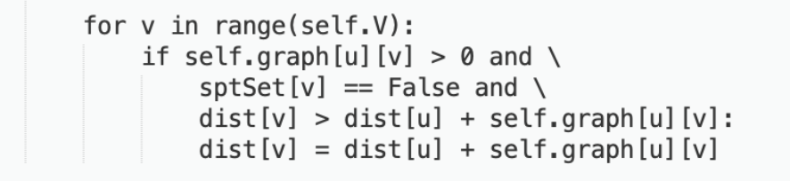
 
Figure 17 Source code snippets
 
## 5.2 Detailed description of functions and parameters
 
def LoadTxt(dir : str) - array
 
This function helps add all products to the database from a .txt file. Dir is the direction of a .txt file. A 2D array with all products information is generated after this.
 
def CreatOrders(num: int, product: list) -  void
 
This function creates a list of orders which a worker needs to execute. products is the list generated by InitialProductList(). num is the number of products in this order. This function can call other functions like InitialProductList(), GeneratePath(), DrawPath() and SetRules().
 
def InitialProductList(num: int, product: list)  -  list
 
This function generates a list of products which need to be picked in a specific order.
 
def GeneratePath()  -  list
 
In this function, a path showed as a list is generated according to the products list.
 
def make_astar_matrix()  -  np.array
 
This function returns the distance matrix which is calculated by Astar algorithm.
 
def atar()
 
This function returns the shortest path between two locations.
 
def brute_force()
 
This function returns the result by using brute force algorithm.
def greedy_nn()
 
This function returns the result by using greedy nearest neighbor algorithm.
 
def SetRules()  -  void
 
This function helps to set the rules.
 
def DrawPath()  -  void
 
This function helps draw the pickup path.
 
def GetPassword()  - string
 
This function is used to get a password.
 
def SetPassword -  void
 
This function is used to set a password.
 
 
## 5.3 Detailed description of input and output formats
 
We will input the text file which includes the product ID, X coordinates and Y coordinates of each product. It will help us locate their position when we click the &#39;Load Products&#39; button and generate a map for direction.
 
The output will be a PNG or HTML which shows our user the shortest path from the starting point to the return area, it will also generate a line to describe the path, like &#39;Smile, B, C, R, M, Y, Smile&#39;.
 
- Syntax/format of a move input by the user
 
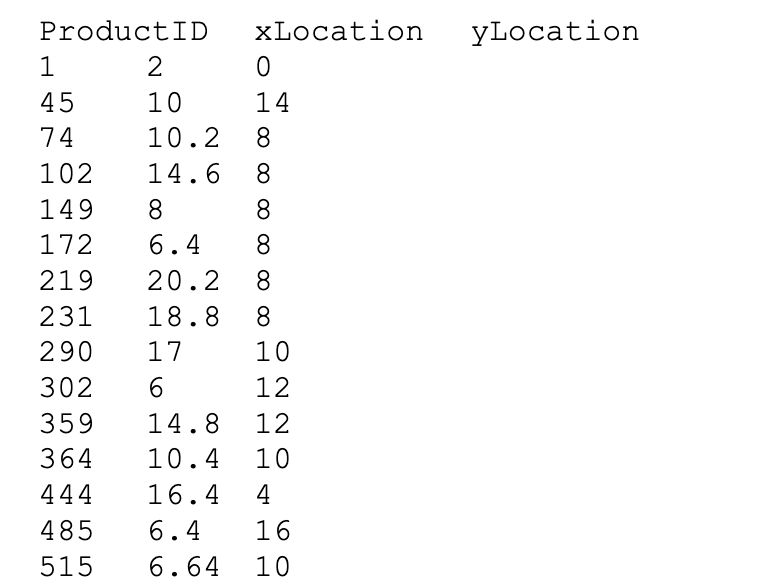
 
Figure 18 Graph data structure
 
- Syntax/format of a move recorded in the log file
 
PNG, HTML with a path and a description of a line of sentence.
 
## 6 Development plan and timeline
 
| week | goal | progress | Hao Yuan | Tianyu Zhao | Haoyu Lyu | Yuanbo Zheng |
| --- | --- | --- | --- | --- | --- | --- |
| 1 | Team formation | Done |
| 2 | Requirement analysis | Done
| 3 | Development manual | In progress | Overall program control flow | Function prototypes | Class Design | I/O Formats |
| 4,5 | UI design/class implementation | Done | UI design | Class implementation | Class implementation | UI design |
| 6,7 | Event listener development/Algorithm design | TBD | Event listener development | Generate png/html path | Generate png/html path | Event listener development |
| 8,9 | Testing | TBD | UI test | System test | System test | UI test |
| 10 | Report | TBD |
 
## 7 Back Matter
 
## 7.1 Copyright
 
Copyright © 2020 T3 Inc. Reserved
 
## 7.2 Error messages
 
| ID | Situation | Type | Date | Error message | Solution |
| --- | --- | --- | --- | --- | --- |
| 1 | Click &#39;Generate path&#39; when no order displayed | NoInputError | Oct. 21, 2020 | Please create an order first! | Create an order before generating a path |
 
## 7.3 Index
 
Format for the graph data:
 
| ProductID | X | Y |
| --- | --- | --- |
| 1 | 2 | 0 |
 
Where ProductID is used to identify each item and X, Y are the coordinates for that product.
 
 

