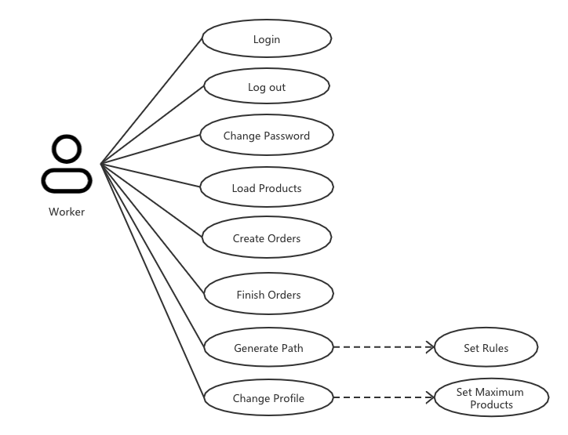
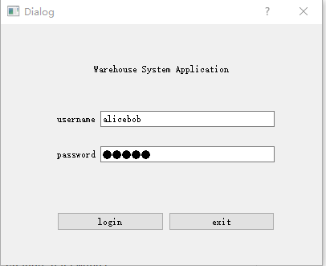
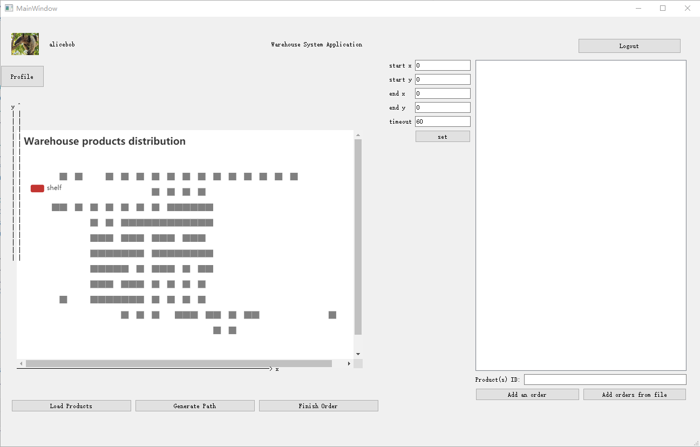
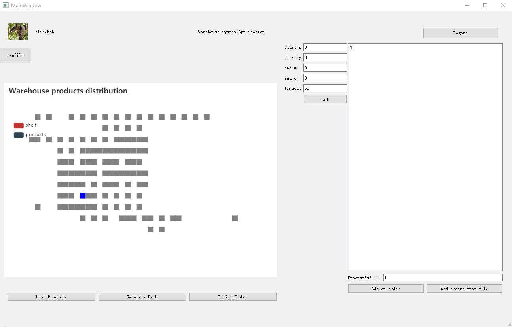
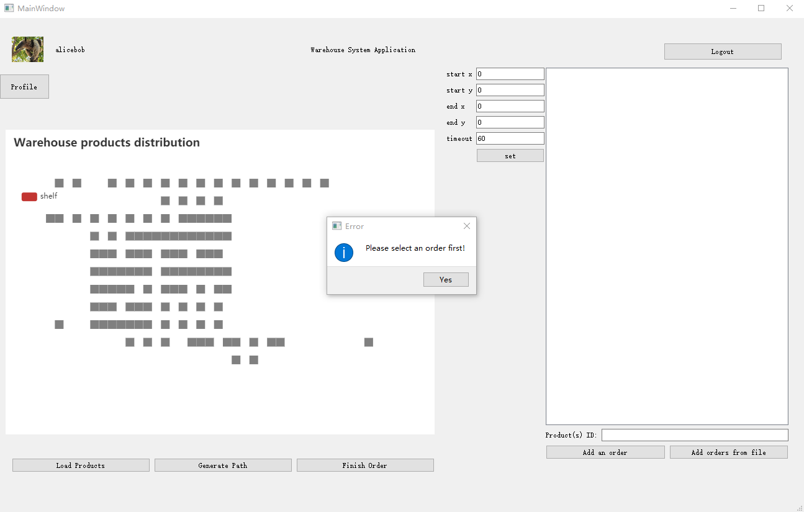
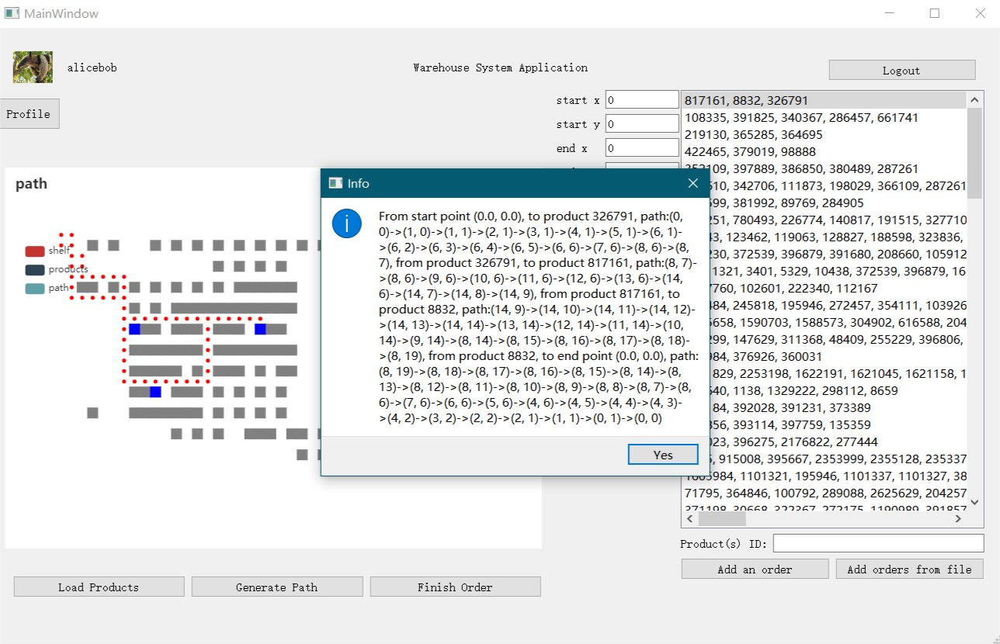
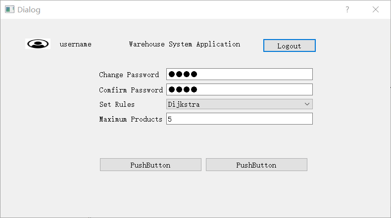
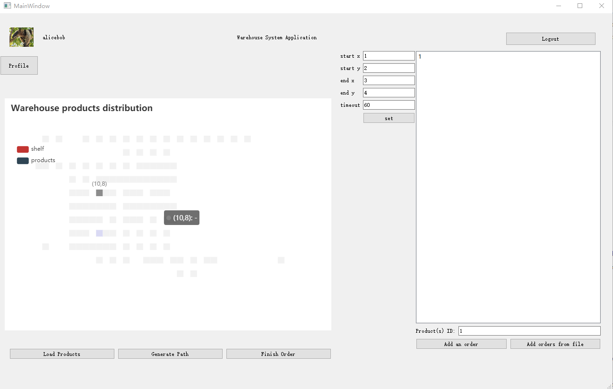
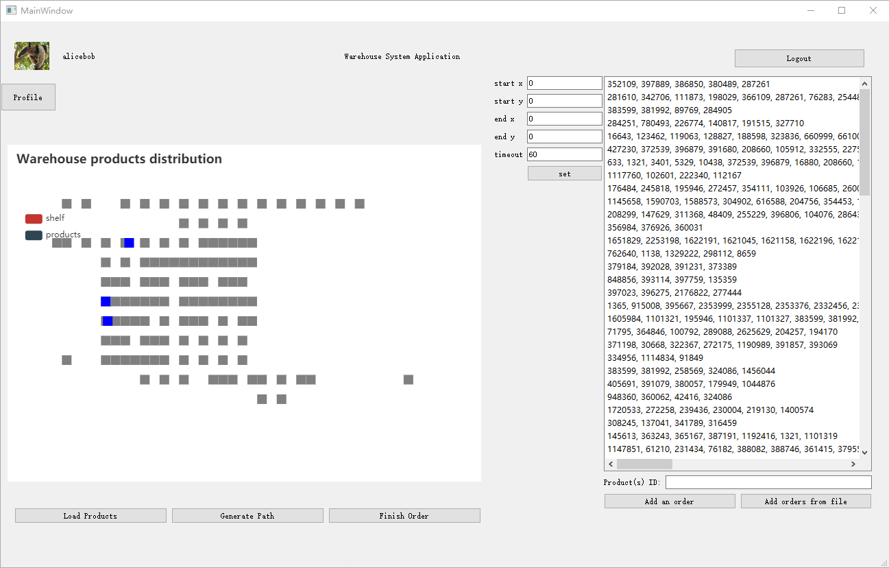

# **Warehouse Navigation Application User Manual**

| Author/Producer | Hao Yuan, Tianyu Zhao, Haoyu Lyu, Yuanbo Zheng |
| --- | --- |
| Affiliation | The Samueli School of Engineering, University of California, Irvine |

# Version Modification Record

| **No.** | **Date** | **Version** | **Modified By** | **Modification** |
| --- | --- | --- | --- | --- |
| 4 | 2020/11/28 | V4.0 | All team member | UI update (timeout, start and end point), load orders form file, timeout  |
| 3 | 2020/11/06 | V3.0 | All team member | Update the graph and UI, added new function for user. |
| 2 | 2020/10/30 | V2.0 | All team member | Update the graph images and description, changed the system requirement. |
| 1 | 2020/10/13 | V1.0 | All team member | Generate All the New Doc.
 |

# Table of Contents

[1 Front Matter 2](#_Toc53576527)

[1.1 Glossary 2](#_Toc53576528)

[2 Overview of System 3](#_Toc53576529)

[2.1 Basic Features: 4](#_Toc53576530)

[2.1.1 Usage instructions/scenarios 4](#_Toc53576531)

[2.2 Advanced Features 4](#_Toc53576532)

[2.2.1 Usage instructions/scenarios 4](#_Toc53576533)

[3 Installation 5](#_Toc53576534)

[3.1 System requirements 5](#_Toc53576535)

[3.2 Setup &amp; configuration 5](#_Toc53576536)

[3.3 Uninstallation 5](#_Toc53576537)

[4 Back Matter 5](#_Toc53576538)

[4.1 Copyright 5](#_Toc53576539)

[4.2 Error messages 5](#_Toc53576540)

[4.3 Index 5](#_Toc53576541)

## 1 Front Matter

## 1.1 Glossary

- **WoBoAI Inc****.**

WOBOAI represents WorkerRobotAI, and it is our company name.

- **QVWEP**

My client: QV&#39;s Warehouse of Extraordinary Products.

- **User ID**

The unique identification of QVWEP account on target platform. It should be user&#39; institution email address. QVWEP should give each user an email address ending with &quot;QVWEP.com&quot;, and they can use this account freely to use the platform. Or QVWEP may need to set the user ID for each user.

- **User Password**

A string that one-to-one corresponds to the QVWEP User ID. It needs input concurrently with the QVWEP User ID when logging in the platform. It is used for protecting account safety.

- **Product(s)**

Products are things that need to be picked up by workers and placed in designated locations.

- **Fields**

Fields should be an area or a point, it is the target position of all the products. Work should bring the products to fields.

## 2 Overview of System

Our program is a python-based system. This system consists of an application for our shopping carts gatherers at our **WoBoAI** store. The system allows our workers to login/change passwords and provides directions/instructions for the worker to pick up products that need to be returned to the &#39;Shopping Products Return Area;. We will set some rules to generate our path, a specific number of products may have different paths to the Return area,etc.

Figure 1 Use case for worker

## 2.1 Basic Features:

The system has the following features:

1. User Login/Logout
2. Load Products/Generate Paths
3. Personal Settings (passwords, rules…)
4. Set start and end point & timeout for algorithm
5. Load orders from file

### 2.1.1 Usage instructions/scenarios

Scenario 1:

Figure 2 Login window

Logging in and Picking up products on an average day.

Figure 3 Failed login

Wrong Username/password, user need re-enter the correct username/password.

Scenario 2: Loading Graphs based on our txt file.

In this interface, a map with several products will be displayed. You can click buttons to load products, generate shortest paths by different rules/algorithms and create orders by clicking the &#39;Add Order&#39; button. Each time we add some products per order.

Figure 4 main window

If you have finished the orders, you can click on the line name with three IDs; Then you can click the finish button to finish the order, and it will be removed from that list.

Figure 5 Add an Order to the list

Figure 6 Finish one Order in the list

When you click the generate button without selecting an order, it will show you a message which you need to select an order first!

Figure 7 Generate path without selecting orders

After you select one order, when you click the &#39;Generate Path&#39; button, the graph below will show us a specific path from the starting point to the return area, a dialog will also shown under the graph which tells the user the meaning of this graph.

Figure 8 Generate path 
 

Scenario 3: Personal Settings.

In this case, you can click the user symbol on the top left corner of the interface. The worker can enter their personal settings to change passwords, set different rulers for the Paths and maximum products to deliver.

Figure 9 Personal setting

Scenario 4: Set start & end point & timeout for algorithm

In this case, users can type in the start point and end point for the algorithm and the timeout(second) so the algorithm can set up the path for the user to follow. After setting is done then click the button to set the values.

Figure 10 Set start & end point & timeout for algorithm

Scenario 5: Load orders from a single txt file

In this case, users can load many orders (product ID) from a local file. So the UI will show all future orders. 

Figure 11 Load orders from a file

## 2.2 Advanced Features

The system has the following features:

1. Settings/Preferences: Generate Path by number of products
2. Settings/Preferences: Set Maximum Products

### 2.2.1 Usage instructions/scenarios

Scenario 1: Generating a Path for a specific number of products to the return area.

Scenario 2: Workers have a limitation of products each time. From figure 8, you can see that in the personal setting, the worker can set the maximum number of products to deliver.

## 3 Installation

## 3.1 System requirements

Platform: Microsoft Windows 10 or Linux-based OS (e.g. Ubuntu)

CPU: Intel i5-4430 or AMD FX-6300

Memory: 1GB RAM

Storage: 1GB available space, graph data might be huge

## 3.2 Setup &amp; configuration

Requirements below:

anaconda3

Python 3.8

PyQt5 5.15.1

PyQt5-tools

PyQtWebEngine 5.15.1

numpy

Matplotlib 3.3.2

Make sure you have installed python 3 and PyQt5 with version 5.15.0 (or above).

Run the python file, then you are good to go.

## 3.3 Uninstallation

If you don&#39;t want to use this application any more, simply delete its source files.

## 4 Back Matter

## 4.1 Copyright

Copyright © 2020 T3 Inc. Reserved

## 4.2 Error messages

| ID | Type | Date | Error message | Solution | Others |
| --- | --- | --- | --- | --- | --- |
| 1 | Click &#39;Generate path&#39; when no order displayed | NoInputError | Oct. 21, 2020 | Please create an order first! | Create an order before generating a path |

## 4.3 Index

Format for the graph data:

| ProductID | X | Y |
| --- | --- | --- |
| 1 | 2 | 0 |

Where ProductID is used to identify each item and X, Y are the coordinates for that product.

